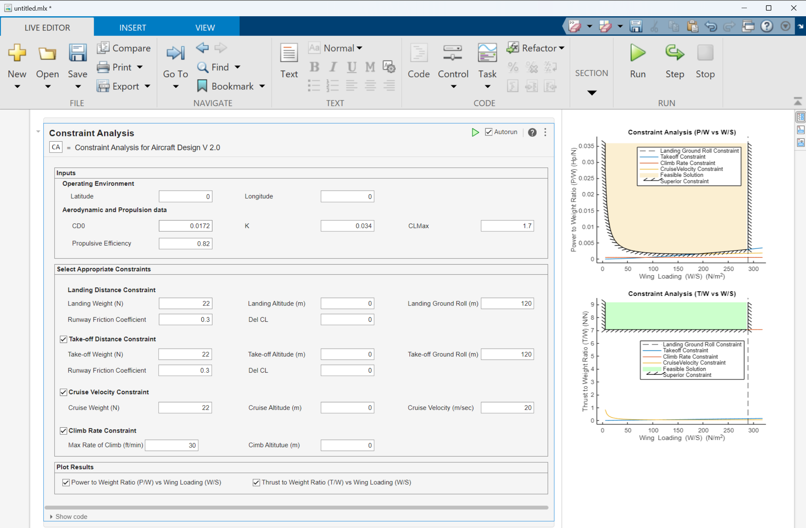
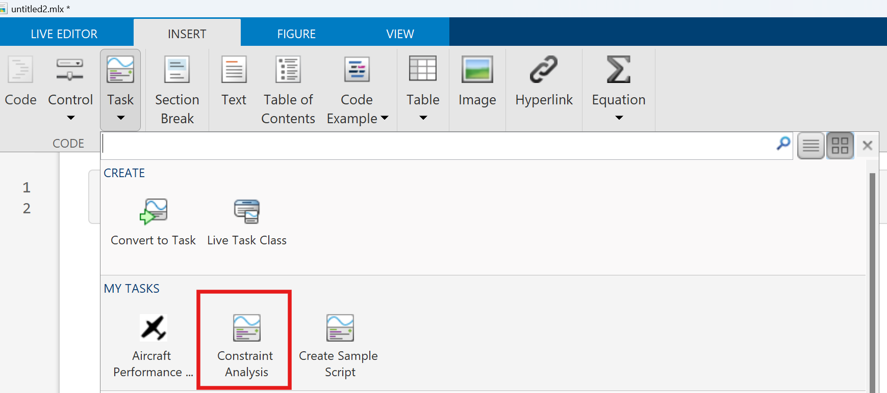

# Constraint Analysis (CA) Live Task for Aircraft Design

<!-- Add this icon to the README if this repo also appears on File Exchange via the "Connect to GitHub" feature --><!-- Add this icon to the README if this repo also appears on File Exchange via the "Connect to GitHub" feature --><!-- Add this icon to the README if this repo also appears on File Exchange via the "Connect to GitHub" feature --><!-- Add .this icon to the README if this repo also appears on File Exchange via the "Connect to GitHub" feature --><!-- Add this icon to the README if this repo also appears on File Exchange via the "Connect to GitHub" feature --><!-- Add this icon to the README if this repo also appears on File Exchange via the "Connect to GitHub" feature --><!-- Add this icon to the README if this repo also appears on File Exchange via the "Connect to GitHub" feature --><!-- Add this icon to the README if this repo also appears on File Exchange via the "Connect to GitHub" feature --><!-- Add this icon to the README if this repo also appears on File Exchange via the "Connect to GitHub" feature --><!-- Add this icon to the README if this repo also appears on File Exchange via the "Connect to GitHub" feature --><!-- Add this icon to the README if this repo also appears on File Exchange via the "Connect to GitHub" feature --><!-- Add this icon to the README if this repo also appears on File Exchange via the "Connect to GitHub" feature --><!-- Add this icon to the README if this repo also appears on File Exchange via the "Connect to GitHub" feature --><!-- Add this icon to the README if this repo also appears on File Exchange via the "Connect to GitHub" feature --><!-- Add this icon to the README if this repo also appears on File Exchange via the "Connect to GitHub" feature --> 

## Introduction

The Constraint Analysis Live Task helps aircraft/UAV designers, in the conceptual design phase, to determine the appropriate design space to meet specified performance requirements. 

From constraint analysis plots, designer can find appropriate ranges of wing loading (W/S), power-to-weight ratio (P/W), and thrust-to-weight ratio (T/W). These values can be used further to calculate the required wing planform area (S) and select the required propulsion system based on power (P) or Thrust (T).

This live task offers the following constraints:
1.	Landing constraint: Based on the total available landing distance.
2.	Take-off constraint: Based on the total available take-off distance.
3.	Cruise velocity constraint: Based on the required maximum velocity at cruise altitude.
4.	Climb rate constraint: Based on the required climb rate at a specified altitude.

<tr>
<td>  </td> 

</tr>

<!-- ## How to use it?
For detailed information on various inputs-outputs, and how to use the Constraint Analysis Live Task, please refer [Live Task Documentation](Live_Task_Documentation.md).  -->

## Setup
To run: 
1.	Download the repository and open it in the MATLAB environment.
2.	Install 'Constraint Analysis V_0.51.mltbx' by double-clicking on it.
3.	Open a new live script and add Constraint Analysis Live Task from Task submenu in Insert tab.
 <td>  </td>

## MathWorks Products (https://www.mathworks.com)
<!--- Make sure you have a License.txt within your Repo --->
1. MATLAB release R2022a or higher
2. [Aerospace Toolbox](https://in.mathworks.com/help/aerotbx/)

## Additional resources
Learn MATLAB with the following resources
1. [MATLAB Onramp](https://matlabacademy.mathworks.com/details/matlab-onramp/gettingstarted)
2. [Explore MATLAB  Examples and Documentation](https://in.mathworks.com/help/matlab/getting-started-with-matlab.html)
3. [Get Started with Introductory MATLAB Videos](https://in.mathworks.com/videos.html#matlabgetstarted)

## License
<!--- Make sure you have a License.txt within your Repo --->

The license for Constraint Analysis Live Task is available in the License.txt file in this GitHub repository.

### 

For any queries, contact the authors at roboticsarena@mathworks.com
<!--- Make sure you have a License.txt within your Repo --->

<!--- Make sure you have a License.txt within your Repo --->
Copyright 2024 The MathWorks, Inc.

